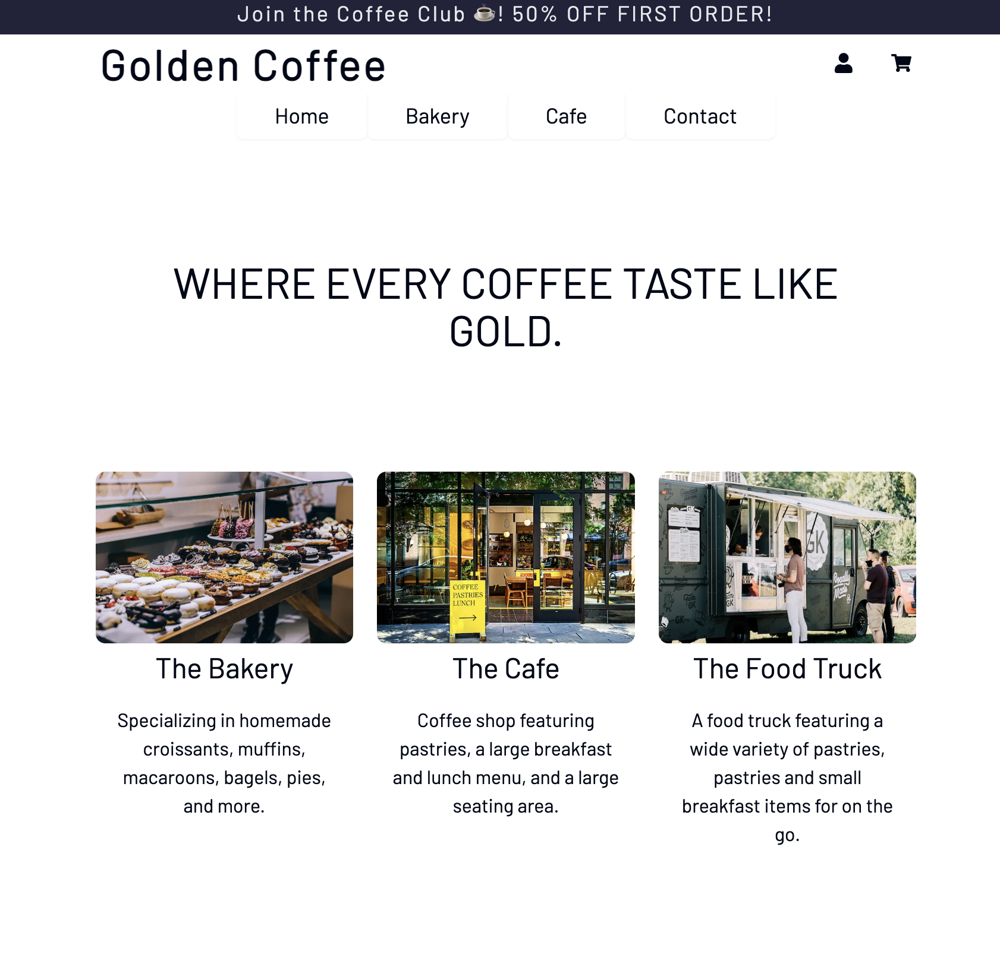
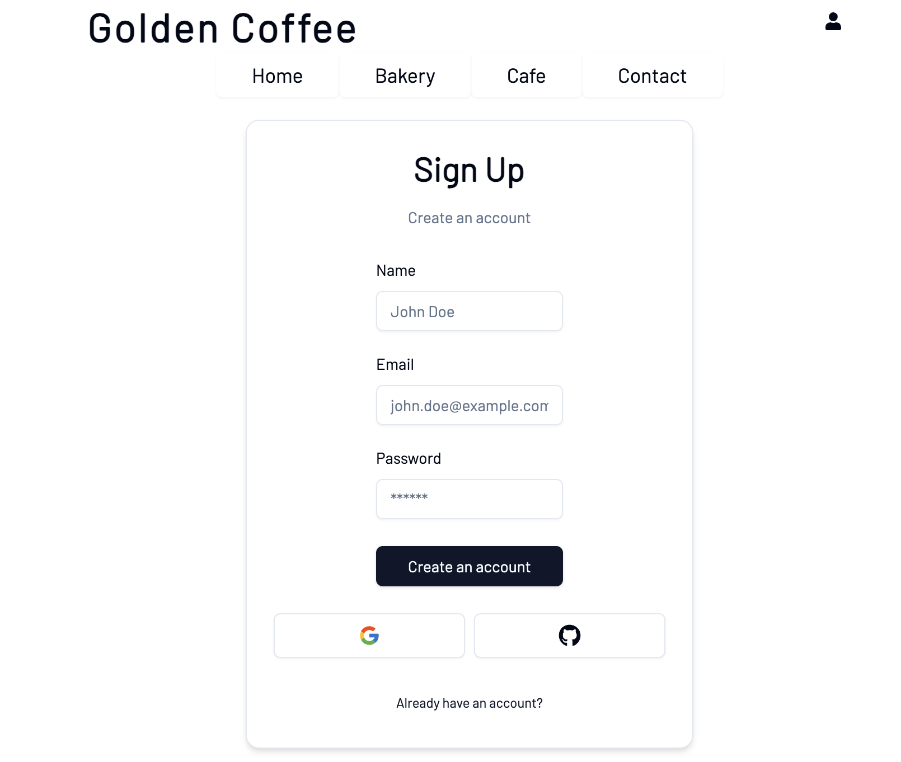
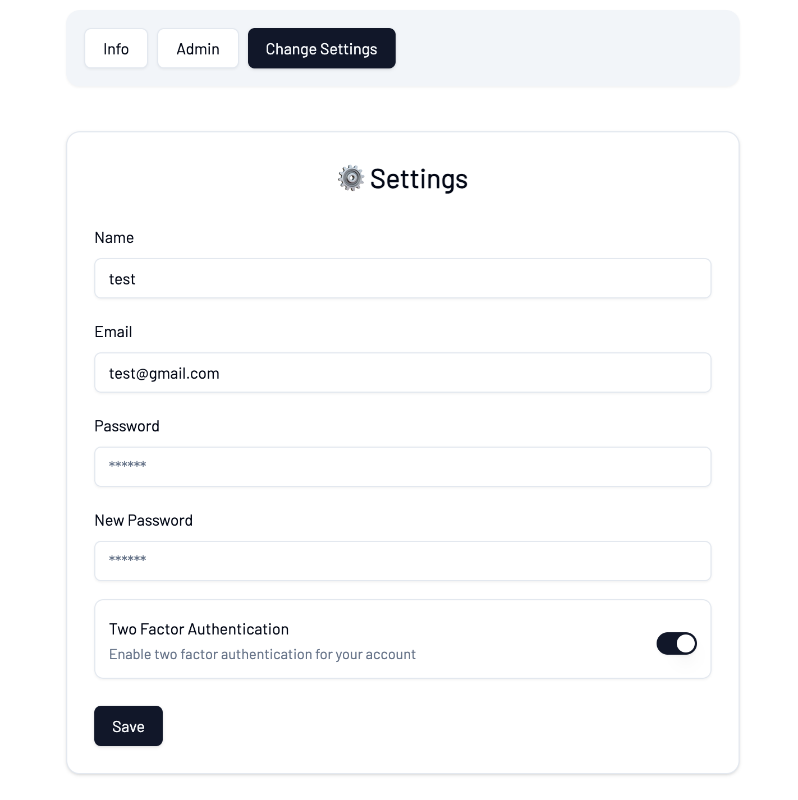
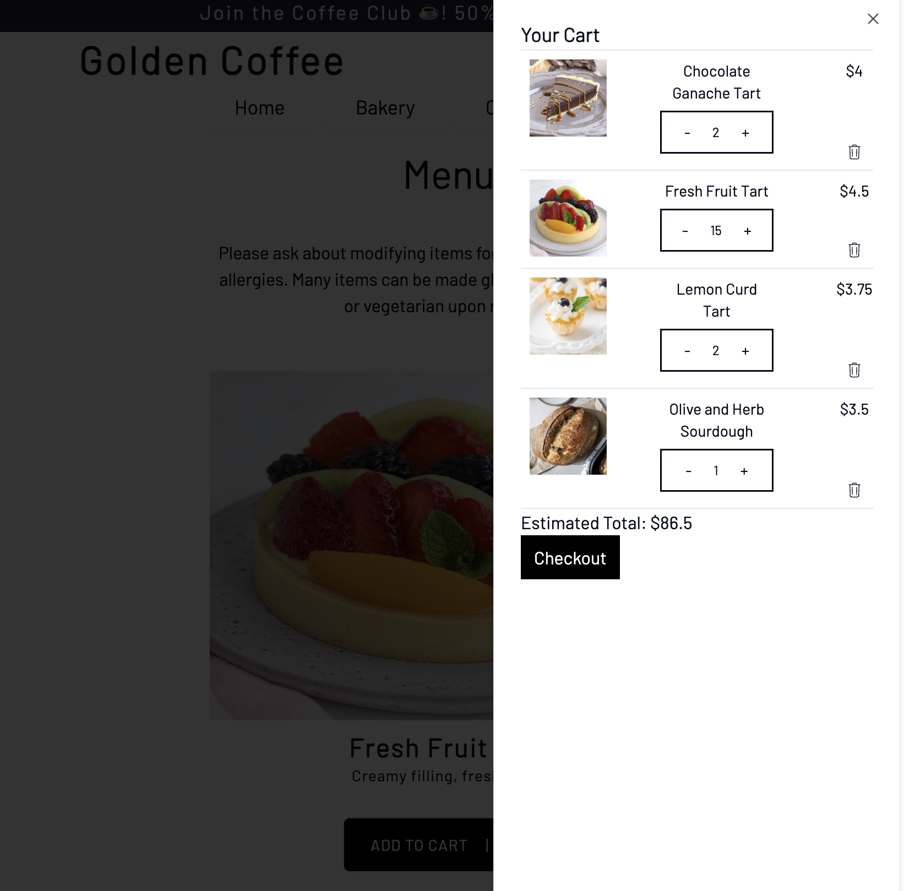
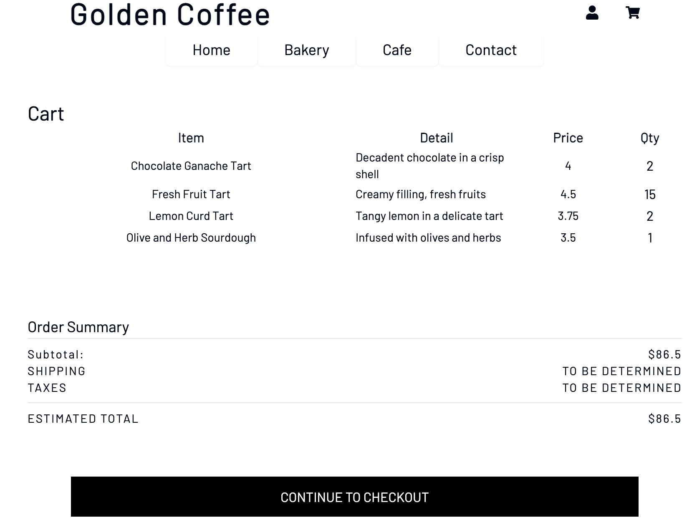
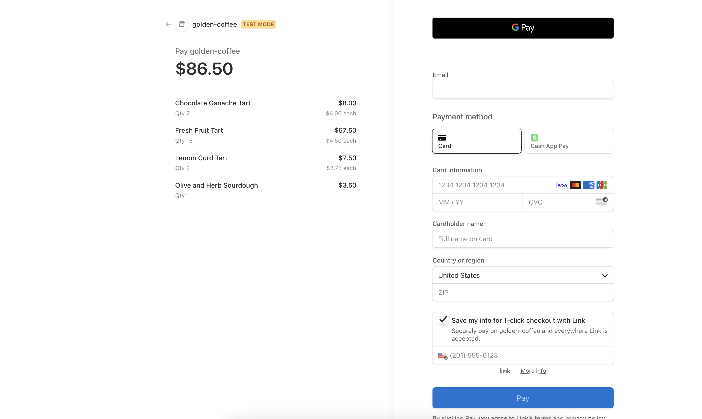

# Golden Coffee Shop

## Description

Golden Coffee shop is a traditional coffee shop that allows users to learn more, register, and buy products. The purpose of building this website was to get more experience in building full stack applications using Next.JS, React, Postgresql, TypeScript, and Tailwind. This was also the first time I used AuthJS, formerly known as NextAuth. This was my first big project that was completely done alone and this project has taken me about 1.5 months. I will continue to work on this project over time and updating it with additional features. There will be a in development feature below on certain features that I still need to add or work on. I definitely learned a lot while working on this project. This was my first time setting up OAuth and using JWT and Session token to temporarily store the user cart. I got more comfortable creating reuseable components using React and not having to re-create new components for everything. During development, I spend several days trying to figure out the correct models to use for user cart and the correct relations to use. I definitely still need more practice with this. Overall, I loved working with this project and I learned so much from it.

[![Typescript][TS.js]][TS-url][![JavaScript][JavaScript]][JavaScript-url][![React][React.js]][React-url][![Postgres][Postgres]][Postgres-url][![Git][Git]][Git-url][![HTML5][HTML5]][HTML5-url][![Prisma][Prisma]][Prisma-url][![Vercel][Vercel]][Vercel-url][![Stripe][Stripe]][Stripe-url][![Tailwind][Tailwind]][Tailwind-url]

## Table of Contents

If your README is long, add a table of contents to make it easy for users to find what they need.

- [Installation](#installation)
- [Usage](#usage)

## Installation

The project is deployed using Vercel and is easily accessible through the link [https://goldencoffee.shop/](https://goldencoffee.shop/)

## Usage

The website is designed using a mobiel-first responsive approach. The website is pleasant to look at from any size device you are using.

The register page allows users to sign up with an email or by using their email/github. Users are not allowed to create an account with the same email used for OAuth or vice versa to ensure unique email in the database.

The settings page allows users to change their names, email, password, and enable 2 factor authentication. Users trying to change their email will be sent a new email verification for safety.

Users are able to add bakery items into their shopping carts and then proceed to checkout. They are able to adjust the quantity of items in their shopping cart and the estimated total will correctly reflect their changes.

Once the user clicks the checkout button, they will be redirected to the main checkout page where they will have a better view of everything in their cart and their total. Clicking the continue to checkout will send a request to the stripe API and proceed with the payment.

---

## Features

- Responsive Web Design
- Allow users to login using email or OAuth
- Email must be verified using verification tokens
- Allow users to enable 2FA for additional safety
- User carts are saved and will be automatically retreived upon login
- Session allows users to be able to stay logged in until it expires
- Middleware functions to protect certain routes until the user is successfully logged in
- Allow users to select between classic and seasonal menu for drinks
- Uses Stripe API for payment

## In Development

[contributors-shield]: https://img.shields.io/github/contributors/open-source-labs/Docketeer.svg?style=for-the-badge
[contributors-url]: https://github.com/open-source-labs/Docketeer/graphs/contributors
[forks-shield]: https://img.shields.io/github/forks/open-source-labs/Docketeer.svg?style=for-the-badge
[forks-url]: https://github.com/open-source-labs/Docketeer/network/members
[stars-shield]: https://img.shields.io/github/stars/open-source-labs/Docketeer.svg?style=for-the-badge
[stars-url]: https://github.com/open-source-labs/Docketeer/stargazers
[issues-shield]: https://img.shields.io/github/issues/open-source-labs/Docketeer.svg?style=for-the-badge
[issues-url]: https://github.com/open-source-labs/Docketeer/issues
[license-shield]: https://img.shields.io/github/license/open-source-labs/Docketeer.svg?style=for-the-badge
[license-url]: https://github.com/open-source-labs/Docketeer/blob/master/LICENSE.txt
[linkedin-shield]: https://img.shields.io/badge/-LinkedIn-black.svg?style=for-the-badge&logo=linkedin&colorB=555
[linkedin-url]: https://www.linkedin.com/company/docketeer
[product-screenshot]: images/screenshot.png
[React.js]: https://img.shields.io/badge/react-%2320232a.svg?style=for-the-badge&logo=react&logoColor=%2361DAFB
[React-url]: https://reactjs.org/
[TS.js]: https://img.shields.io/badge/typescript-%23007ACC.svg?style=for-the-badge&logo=typescript&logoColor=white
[TS-url]: https://www.typescriptlang.org/
[JavaScript]: https://img.shields.io/badge/javascript-%23323330.svg?style=for-the-badge&logo=javascript&logoColor=%23F7DF1E
[JavaScript-url]: https://www.javascript.com/
[Node.js]: https://img.shields.io/badge/node.js-6DA55F?style=for-the-badge&logo=node.js&logoColor=white
[Postgres]: https://img.shields.io/badge/postgres-%23316192.svg?style=for-the-badge&logo=postgresql&logoColor=white

[Postgres-url]: https://img.shields.io/badge/postgres-%23316192.svg?style=for-the-badge&logo=postgresql&logoColor=white](https://www.postgresql.org/)
[Git]: https://img.shields.io/badge/git-%23F05033.svg?style=for-the-badge&logo=git&logoColor=white
[Git-url]: https://git-scm.com/
[HTML5]: https://img.shields.io/badge/html5-%23E34F26.svg?style=for-the-badge&logo=html5&logoColor=white
[HTML5-url]: https://www.w3schools.com/html/
[Prisma]: https://img.shields.io/badge/Prisma-3982CE?style=for-the-badge&logo=Prisma&logoColor=white
[Prisma-url]:https://www.prisma.io/
[Vercel]: https://img.shields.io/badge/Vercel-000000?style=for-the-badge&logo=vercel&logoColor=white
[Vercel-url]:https://vercel.com/home
[Stripe]: https://img.shields.io/badge/Stripe-626CD9?style=for-the-badge&logo=Stripe&logoColor=white
[Stripe-url]: https://docs.stripe.com/
[Tailwind]:https://img.shields.io/badge/Tailwind_CSS-38B2AC?style=for-the-badge&logo=tailwind-css&logoColor=white
[Tailwind-url]: https://tailwindcss.com/
